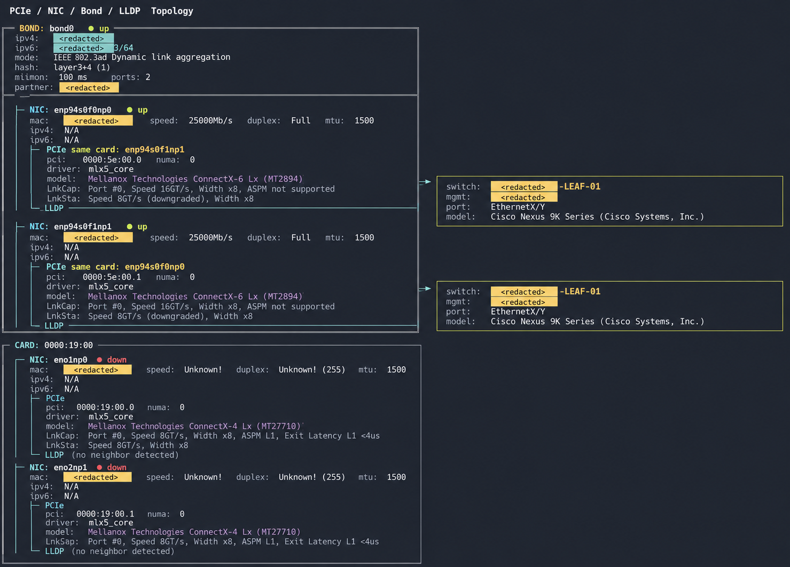

# netlink
Show the network link information, summary from lshw, lspci, iproute2, ethtool and LLDP.

NIC and bond details include IPv4 and IPv6 addresses with prefix lengths, collected
using `ip -j address show dev <interface>` (iproute2). Multiple addresses are shown
on separate lines. `N/A` means no address was found or address data is unavailable.

In color output, IP addresses use a cyan background and MAC addresses use a yellow
background. Use `python3 netlink.py --color | less -SR` to keep colors when piping.

Topology boxes fit the displayed text with one space before the right border;
LLDP connections use a compact `─►` connector between boxes.

example usage:

```
curl -L -sS https://raw.githubusercontent.com/laixintao/netlink/refs/heads/main/netlink.py | sudo python3 - --color | less -SR
```

output:


